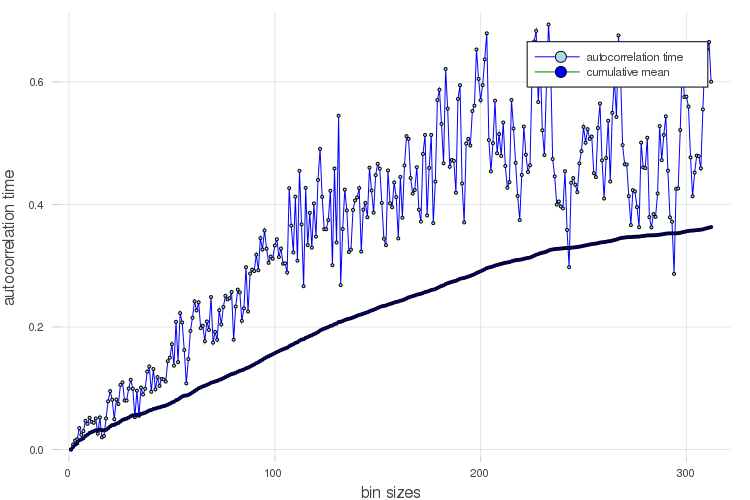

# BinningAnalysisPlots.jl

Plotting recipes for [BinningAnalysis.jl](http://github.com/crstnbr/BinningAnalysis.jl).

This package is very lightweight. Apart from BinningAnalysis.jl, it only depends on RecipesBase.jl and StatsBase.jl.

Supported series types

* `FullBinner`: `plot, histogram, binning, corrplot, tauplot`
* `LogBinner`: `binning, corrplot, tauplot`

## Examples

```julia
using Plots, BinningAnalysis, BinningAnalysisPlots, Distributions, LinearAlgebra

"""
Generate fake data with a bit of correlation
"""
function generate_correlated_data(n)
    n_thermalize = floor(Int, 0.03*n)
    A = Base.clamp.(0.3 .+ rand(n_thermalize,n_thermalize), 0, 1);
    A = 0.5*(A+A');
    issymmetric(A)
    A = A + n_thermalize*I;
    @assert isposdef(A)
    C = cholesky(A);
    y_corr = C.L'*rand(n_thermalize)

    i = floor(Int, n_thermalize*0.9)
    μ = mean(y_corr[i:end])
    σ = std(y_corr[i:end])
    y = vcat(y_corr, rand(Normal(μ, σ), n-n_thermalize))
end

n = 10_000
data = generate_correlated_data(n)

x = FullBinner(data)

plot(x)
histogram(x)
binning(x)
corrplot(x)
tauplot(x)
```



