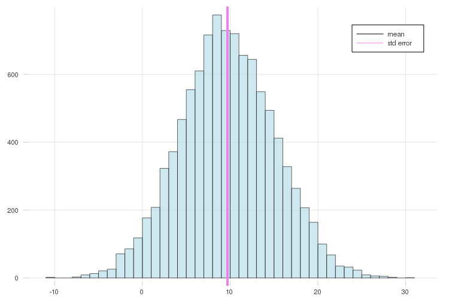
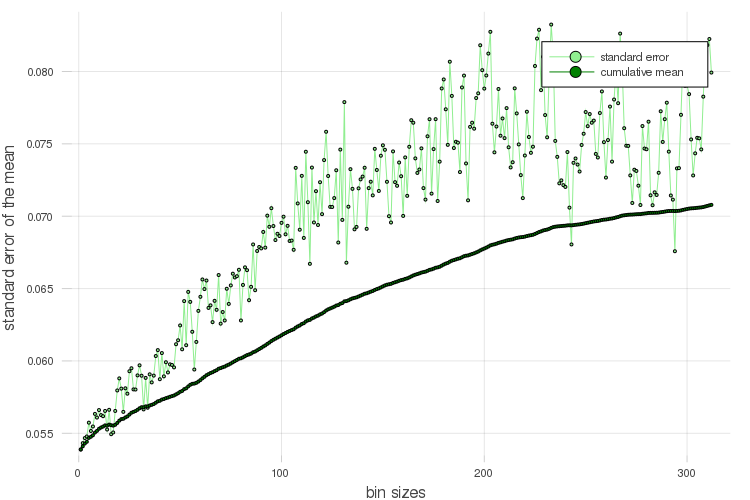
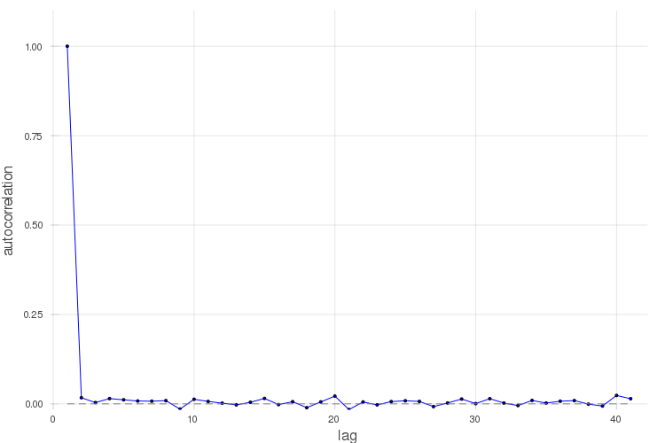

# BinningAnalysisPlots.jl

Plotting recipes for [BinningAnalysis.jl](http://github.com/crstnbr/BinningAnalysis.jl).

This package is very lightweight. Apart from BinningAnalysis.jl, it only depends on RecipesBase.jl, which has **zero** dependencies itself.

Supported series types

* `FullBinner`: `plot, histogram, binning, corrplot`
* `LogBinner`: `binning, corrplot`

## Examples

```julia
using Plots, BinningAnalysis, BinningAnalysisPlots

x = FullBinner(randn(1000)) # uncorrelated test data

plot(x)
histogram(x)
binning(x)
corrplot(x)
```





